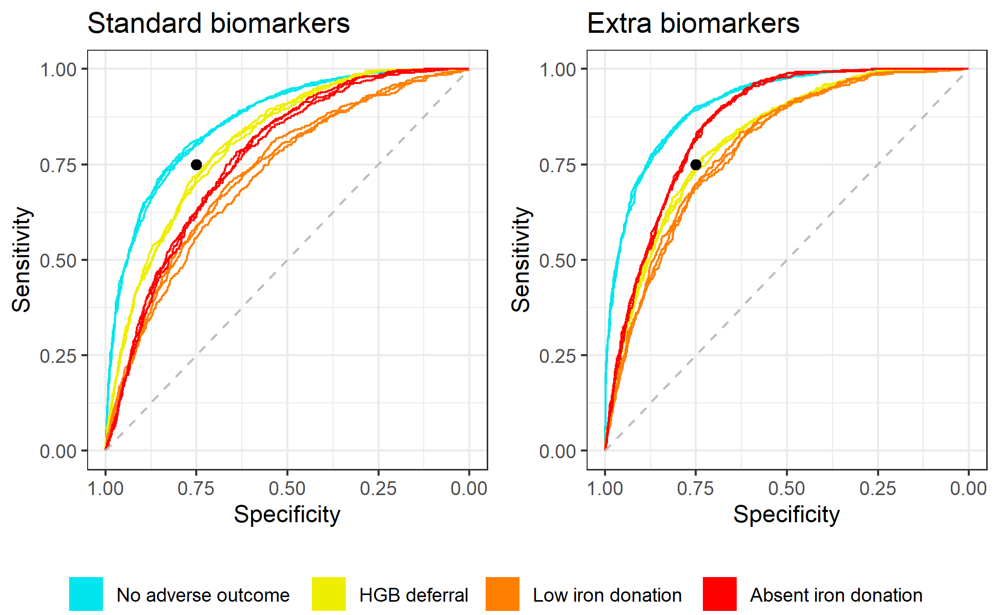

\newcommand{\1}{\textbf{1}}

<br>

W. Alton Russell^1,2^, David Schienker^1,3,4,5^, Brian Custer^2,6^

<br>

^1^Department of Management Science and Engineering, Stanford University Stanford, CA

^2^Epidemiology and Health Policy Science, Vitalant Research Institute, San Francisco, CA

^3^Lucile Packard Children's Hospital Stanford, Palo Alto, CA, USA

^4^Pediatric Endocrinology, Stanford School of Medicine, Palo Alto, CA, USA

^5^Clinical Excellence Research Center, Stanford School of Medicine, Palo Alto, CA, USA

^6^Department of Laboratory Medicine, University of California, San Francisco, CA

<br>

**Corresponding author:** W. Alton Russell, Harvard Medical School, 101 Merrimac St, Room 1032, Boston, MA, 02114, United States. email: [warussell\@mgh.harvard.edu](mailto:warussell@mgh.harvard.edu){.email}.

**Funding:** WAR was funded by a Stanford Interdisciplinary Graduate Fellowship.

**Conflicts:** The authors have no conflicts of interest to declare.

**Running title:** Blood donor iron risk trajectories

<br>

Main text: 3499 words \| Abstract: 249 words \| Tables: 2 \| Figures: 6

##### 

```{r setup, include=FALSE}
library(ggplot2)
library(data.table)
library(scales)
library(flextable)
library(officedown)
library(officer)
library(readxl)
theme_set(theme_bw())
knitr::opts_chunk$set(echo = FALSE)

```

# Abstract

**Background:** Despite a fingerstick hemoglobin requirement and 56-day minimum donation interval, repeat blood donation continues to cause and exacerbate iron deficiency.

**Study design and methods:** Using data from the REDS-II Donor Iron Status Evaluation study, we developed multiclass prediction models to estimate the competing risk of hemoglobin deferral and collecting blood from a donor with sufficient hemoglobin but low or absent underlying iron stores. We compared models developed with and without two biomarkers not routinely measured in most blood centers: ferritin and soluble transferrin receptor. We generated and analyzed 'individual risk trajectories': estimates of how each donors' risk developed as a function of the time interval until their next donation attempt.

**Results:** With standard biomarkers, the top model had a multiclass area under the receiver operator characteristic curve (AUC) of 77.6% (95% CI 77.3% - 77.8%). With extra biomarkers, multiclass AUC increased to 82.8% (95% CI 82.5% - 83.1%). In the extra biomarkers model, ferritin was the single most important variable, followed by the donation interval. We identified three risk archetypes: 'fast recoverers' (\<10% risk of any adverse outcome on post-donation day 56), 'slow recoverers' (\>60% adverse outcome risk on day 56 that declines to \<35% by day 250), and 'chronic high-risk' (\>85% risk of adverse outcome on day 250).

**Discussion:** A longer donation interval reduced estimated risk of iron-related adverse events for most donors, but risk remained high for some. Tailoring safeguards to individual risk estimates could reduce blood collections from donors with low or absent iron stores.

<br>

**Key words:** blood donation, iron deficiency, ferritin, hemoglobin

##### 

# Introduction

> Repeat blood donation can cause or exacerbate iron deficiency, with higher incidence among teen donors and premenopausal women [@Cable2012; @Salvin2014; @Spencer2019; @Baart2013; @Rigas2014; @Patel2019]. In the United States, potential donors are screened using fingerstick hemoglobin or hematocrit tests and deferred if levels are below a minimum cutoff. Currently, minimum hemoglobin levels are 12.5 g/dL for women and 13.0 g/dL for men. Because fingerstick hemoglobin is an unreliable indicator of iron stores, some donors with low or absent iron stores qualify to donate and are subjected to further iron loss [@Baart2013]. In addition, low hemoglobin deferrals consume time and resources for both donors and blood centers, decrease donor satisfaction, and reduce the likelihood of future donations [@Custer2007]. More reliable measures of iron status include ferritin, zinc protoporphyrin, soluble transferrin receptor, and hepcidin, but these are more costly to measure, and most are not yet available as point of care tests [@Kiss2018].

> Past studies have identified several factors that increase risk of iron deficiency among blood donors. The Danish Blood Donor Study found that sex, menopause status, and donation history were the strongest predictors of iron deficiency among donors, and weight, age, vitamin use, and diet were also significant [@Rigas2014]. Similar results have been found for donors in the United States, Australia, and the Netherlands [@Cable2012; @Salvin2014; @Spencer2019; @Baart2013; @Patel2019]. Other studies identified age, time since last donation, and donation history as strong predictors of a low hemoglobin deferral for repeat blood donors [@Baart2011; @Baart2012]. To our knowledge, no prediction model has been developed that considers the competing risks of hemoglobin deferral and of collecting blood from a donor with sufficient hemoglobin but low or absent underlying iron stores.

> In this study, we used data for a cohort of donors from the REDS-II Iron Status Evaluation (RISE) study [@Cable2016] and machine learning models to generate individual risk trajectories: estimates of how a donor's risk of hemoglobin deferral or giving blood while iron stores are low or absent iron stores will develop based on the length of time until the donor returns for a subsequent donation attempt.

<br>

# Methods

> Using data from the RISE study, we trained multiclass prediction models to estimate the risk of three iron-related adverse outcomes at a subsequent donation attempt: hemoglobin deferral, donating with low iron stores, and donating with absent iron stores. We assessed the models' predictive performance, compared performance with and without the inclusion of two non-routine biomarkers (ferritin and soluble transferrin receptor [STfR]) as features for prediction, and generated and analyzed individual risk profiles for each donor's likelihood of iron-related adverse donation outcomes at their next visit as a function of their donation interval (how long until the donor returns). We have shared all code in a public repository [@Russell2021i] and provide the TRIPOD checklist (`r run_reference("t-tripod")`) [@Collins2015].

## Data preprocessing and formatting

> The RISE dataset contains visits to six U.S. blood centers for 2,425 donors over a 2-year period December 2007 -- December 2009 [@Cable2016]. Participants were enrolled after completing a whole blood donation and agreed to donate frequently over the next two years. The study targeted equal numbers of male and female donors and about twice as many frequent donors compared to first time or reactivated donors. Collected data elements include donation history, biometrics for each visit, and questionnaire responses regarding demographics, diet, supplemental iron consumption, female reproductive health, and demographics.

> To develop the 'standard biomarkers' model, we used 46 variables available for donations in the RISE dataset together with the time interval until the donor returns to predict the outcome of a follow-up donation attempt. We assumed that donor characteristics measured only at the baseline visit (diet, vitamin use, smoking, female reproductive health indicators) would not change significantly over the study period, and we used them to predict outcomes following subsequent donations by the same donor. We also developed an 'extra biomarkers' model, for which we included ferritin, STfRr, and derived measures (log ferritin, ratio of STfR to log ferritin, and calculated body iron) as features for prediction. We re-coded or imputed missing values for some fields as described in `r run_reference("t-feature-engineering")`. We also included a composite dietary iron consumption score that was generated in a prior secondary analysis of the RISE dataset [@Spencer2019a].

> The model development dataset included index donations with at least 150 mL of red blood cell loss. This included whole blood donations, mixed apheresis donations that included a single red cell unit, and some donations that were classified as 'quantity not sufficient'. We excluded potential index donations that were double red cell donations due to limited data, the altered iron recovery profiles that follow the large iron loss from double red collection, and the 112-day mandatory deferral period after such donations. We also excluded donations that were missing a measurement of ferritin and donations for which neither fingerstick hemoglobin nor hematocrit was recorded. If follow-up visits were recorded after potential index donations, we generated labels with the time until the follow-up visit (in days) and its outcome. For all index donations followed by a visit with significant iron loss, defined as a loss of at least 55 mL of red blood cells, we generated a label for the index donation based on the first such follow-up visit. Additionally, we generated labels for any follow-up visits that did not result in significant iron loss (i.e., visits resulting in a deferral or apheresis donations of platelets or plasma with \<55 mL of red blood cell loss) if they occurred before the first follow-up visit with significant iron loss. For each index donation $i$, the outcome of its follow-up visits ($z_i$) was classified as hemoglobin deferral (labeled as $z_i=1$) if one were recorded; as a low iron donation ($z_i=2$) if pre-donation ferritin was $\geq12$ mg/dl and $<20$ mg/dl for women or $\geq12$ mg/dl and $<30$ mg/dl for men; as an absent iron donation ($z_i=3$) if pre-donation ferritin was \<12 mg/dl; and as a 'no adverse outcome' donation otherwise ($z_i=0$). Follow-up donations without ferritin measurements ($z_i=-1$) were not included in the model development dataset but were included in a 'first return' dataset used to calibrate the model and generate risk trajectories (described below).

## Prediction model development

### Model selection

> We evaluated several candidate model types: gradient boosted machines, random forests, regression trees, and generalized linear models with elastic net regularization (with and without second order interaction terms). To optimize performance while minimizing overfitting, we evaluated multiple parameter configurations via grid search with nested cross validation and resampling (`r run_reference("t-mod-tuning")`) [@Varma2006]. We generated 15 *model assessment partitions* consisting of 3 resamples of 5 equal-sized partitions of the entire dataset. For each model assessment partition, we defined all data not included in the partition as the corresponding *model tuning set*. Within the 15 tuning sets, we assessed all candidate model configurations (model type and hyperparameter setting) using 5-fold validation, assessing the multiclass area under the reliever operator characteristic curve (multiclass AUC) using the Hand and Till method [@Hand2001]. We used stratified sampling to ensure the distribution of outcomes was balanced across partitions. We compared model configurations based on the average multiclass AUC across 5 cross validation folds averaged over all 15 tuning sets (assessing a total of 75 realizations of each candidate model configuration).

> We also evaluated ensemble models, which combine the risk scores from multiple base models. We assessed two methods of combining risk scores from base models: a simple average and a weighted average, for which we weighted each model's score proportionally to its accuracy raised to a power of four as suggested by Large et. al. [@Large2019]. We assessed AUC for each candidate ensemble configuration across the same 5 cross validation folds within each of the 15 tuning sets.

> We selected the top model configuration based on multiclass AUC. To produce an unbiased assessment of the selected model configuration, we then assessed multiclass AUC on each of the 15 model assessment partitions. For each assessment partition, we trained the model configuration on all data not in the partition and used this model to generate risk scores on the assessment partition and calculate multiclass AUC. We completed this model development process both with ferritin, STfR, and derived measures as features (extra biomarkers model) and without (standard biomarkers model). We also computed one-vs-rest AUC for each feature, a measure of how well the model discriminates one outcomes from the other three.

### Feature importance

> For the top-performing "standard" and "extra biomarkers" model configurations, we assessed the importance of features for prediction using a random permutation method [@Breiman2001]. We trained the model on an altered version of each model tuning sets in which one feature column was randomly shuffled. We then generated risk scores for the corresponding model assessment partition and calculated the multiclass AUC. We calculated the percent decrease in multiclass AUC when a feature's column was shuffled as compared to using the unaltered model tuning sets, which we used as a measure of the feature's importance to the model.

### Calibration

> To generate the final model, we retrained the selected model configurations on the entire model development dataset and calibrated the predicted probabilities to the 'first return' dataset. In this dataset, index donations were labeled only once with the outcome of the first subsequent donation attempt, which included follow-up donations with no ferritin measurement. We estimated the distribution of outcomes in this dataset by assuming that followup donations with no ferritin measurement would have the same distribution of absent, low, and 'no-adverse outcome' donations as did the follow-up donations for which ferritin was measured. Mathematical details are provided in the supplemental methods.

## Risk trajectory analysis

> For each index donation, we generated a risk trajectory using the calibrated 'extra biomarkers' model by predicting the likelihood of each outcome at the donor's next donation attempt for each possible follow-up donation interval between 56 and 250 days. We generated graphical representations of individual donors' risk trajectories showing how the estimated risk of each adverse outcome evolves depending on the number of days until the donor returns. To illustrate differences in risk trajectories, we created three recovery archetypes: 'fast recoverers' (\<10% risk of any adverse outcome on post-donation day 56), 'slow recoverers' (\>60% adverse outcome risk on day 56 that declines to \<35% by day 250), and 'chronic high-risk' (\>85% risk of adverse outcome on day 250). These archetypes were constructed to illustrate risk trajectories with different policy implications and are not meant to be exhaustive. In a separate subgroup analysis, we compared the mean and 95% confidence interval for the estimated risk of each adverse outcome as a function of the donation interval for groups of donors stratified by selected parameters.

<br>

# Results

## Data processing

```{r echo=FALSE, include=FALSE}
dt.md <- fread( "../1_data/model_dev_data/ml_training_data.csv")
dt.firstreturn <- fread("../1_data/first_return_dataset.csv")
dt.frXB <- dt.firstreturn[!is.na(FingerstickHGB_equiv)]
dt.frXB<-dt.frXB[time_to_fu >=56]
dt.frXB <- dt.frXB[!is.na(ARUP_Ferritin)]

add_footnotes <- function(ft, notes){
  
  for (idx_note in 1:length(notes)){
    note =  notes[[idx_note]]
    if (is.na(note[[2]])){
      col <- colnames(ft$body$dataset)[1]
      ft <- compose(ft, i= note[[1]], 
                  part = note[[3]],
                  value = as_paragraph(get(col), as_sup(as.character(idx_note))) )
      
      ft <- merge_h(ft, i = note[[1]])
      
    } else {
      col = ft$col_keys[note[[2]]]
      
      ft <- compose(ft, i= note[[1]], 
                  j = note[[2]], 
                  part = note[[3]],
                  value = as_paragraph(get(col), as_sup(as.character(idx_note))) )
    }
    
  }
  
  
  ft <- compose(ft,
                i = nrow(ft$body$dataset),
                part = "body",
                value = as_paragraph(paste(paste0(1:length(notes), ". ", unlist(sapply(notes, `[`, 4))), collapse='\n')))
  ft <- merge_h(ft, i = nrow(ft$body$dataset), part="body")
  # ft <- italic(ft, i = nrow(ft$body$dataset),
  #               j=1,
  #               part = "body")
  ft <- color(ft, i = nrow(ft$body$dataset),
                j=1,
              color = "#696969",
                part = "body")
  
  #ft <- merge_h(ft, i = nrow(ft$body$dataset), part="body")
  
  return(ft)
}

flextable_with_foot <- function(dt, notes, group = NA){
  
  if (!is.na(group)){
    
    # dt <- data.table(as_grouped_data(data.table(df),
    #                                           groups = "Setting"))
    # dt <- rbind(dt,
    #             matrix(NA, ncol = ncol(dt)),
    #                       use.names = FALSE)
    # ft <- flextable(dt)
    dt <- data.table(as_grouped_data(data.table(dt),
                                              groups = group))
    
    dt <- rbind(dt,
                matrix(NA, ncol = ncol(dt)),
                          use.names = FALSE)
    ft <- flextable(dt,
                    col_keys = colnames(dt)[-1])
    ft <- compose(ft, i = ~ !is.na(get(group)),
              value = as_paragraph(get(group)))
    ft <- add_footnotes(ft, notes)
    
    ft <- merge_h(ft, i = !is.na(ft$body$dataset[,1]))
    
  } else {
    ft <- flextable(rbind(data.table(dt),
                          matrix("blank", ncol = ncol(dt)),
                          use.names = FALSE))
    ft <- add_footnotes(ft, notes)
  }
  
  
  ft <- fontsize(ft, size = 8, part = "all")
  ft <- align(ft, align = "left", part = "all")
  ft <- bg(ft, bg = "#EAEAEA", part = "header")
  ft <- theme_box(ft)
  
  return(ft)
}


dt.md[ , donation_id := paste0(RandID, "-V", VisitNum)]
tbl_labels_per_idx <- table(dt.md[ , .N, by = donation_id]$N)


#Correlation
dt.corr <- fread( "../3_intermediate/corr_table_data.csv")
dt.corr[, `Correlation coefficient`:=signif(`Correlation coefficient`, 2)]

```

> The RISE dataset contained `r nrow(dt.firstreturn)` potential index donations (completed donations followed by a return visit from the same donor) from `r dt.firstreturn[, uniqueN(RandID)]` donors. We excluded `r dt.firstreturn[is.na(FingerstickHGB_equiv), .N]` potential index donations because hemoglobin was not recorded, `r dt.firstreturn[!is.na(FingerstickHGB_equiv) & is.na(ARUP_Ferritin),.N]` because ferritin was not recorded, and a further `r dt.firstreturn[!is.na(FingerstickHGB_equiv) & !is.na(ARUP_Ferritin) & time_to_fu < 56, .N]` potential index donations because the first follow-up visit with significant iron loss was less than 56 days later. The first return dataset contained `r dt.firstreturn[!is.na(FingerstickHGB_equiv) & !is.na(ARUP_Ferritin) & time_to_fu >= 56, .N]` index donations labeled with the outcome of the first follow-up donation. That outcome was a hemoglobin deferral for `r dt.frXB[fu_outcome == 1, .N]` index donations; a low-iron donation for `r dt.frXB[fu_outcome == 2, .N]`; an absent iron donation for `r dt.frXB[fu_outcome == 3, .N]`; no adverse outcome for `r dt.frXB[fu_outcome == 0, .N]`; and a completed donation with unknown iron status for `r dt.frXB[fu_outcome == -1, .N]`. After adjusting for follow-up visits with no ferritin measurement, 54% of follow-up visits led to an adverse outcome. On average, follow-up visits leading to hemoglobin deferral were preceded by the shortest inter-donation interval, and follow-up visits resulting in no adverse outcome were preceded by the longest interval (`r run_reference("t-fr-outcomes")`). The model development dataset included `r dt.md[ , uniqueN(donation_id)]` unique index donations from `r dt.md[ , uniqueN(RandID)]` donors. `r tbl_labels_per_idx[[1]]` index donations were labeled with one follow-up donation, `r tbl_labels_per_idx[[2]]` were labeled twice, and `r dt.md[ , uniqueN(donation_id)] - tbl_labels_per_idx[[1]] - tbl_labels_per_idx[[2]]` were labeled with 3 or more follow-up visit outcomes (maximum of 8).

## Prediction model

```{r echo=FALSE, include=FALSE}
dt.aucs <- fread("../4_output/AUC_results_meanCI.csv")

dt.aucs[, disp_val := paste0(
  percent(mean, accuracy=0.1), " (95% CI ",
  percent(lb, accuracy=0.1)," - ",
  percent(ub, accuracy=0.1),")")]

dt.aucs[, tab_val := paste0(
  percent(mean, accuracy=0.1), " (",
  percent(lb, accuracy=0.1)," - ",
  percent(ub, accuracy=0.1),")")]

#calculate difference in AUC standard vs extra biomarekrs
dt.aucs_noXB <- dt.aucs[version=="noXB"]
dt.aucs_XB <- dt.aucs[version=="withXB"]
dt.aucs_diff <- cbind(dt.aucs_XB[,"outcome"],
                   "Difference" = percent(dt.aucs_XB$mean - dt.aucs_noXB$mean,
                           accuracy=0.1)  
)

#format for the table
dt.aucs_tab <- dcast(dt.aucs, 
                    formula = outcome~version,
                    value.var = "tab_val")

dt.aucs_tab <-dt.aucs_tab[dt.aucs_diff,on="outcome"]

outcome_disp_list <- list(
  Overall = "Multiclass AUC",
  Z0 = "No adverse outcome",
  Z1 = "Hemoglobin deferral",
  Z2 = "Low iron donation",
  Z3 = "Absent iron donation"
)

dt.aucs_tab[ , outcome_disp := outcome_disp_list]
dt.aucs_tab[ , category := c("Multiclass AUC", rep("One-vs-rest AUC",4))]
setcolorder(dt.aucs_tab, c("category","outcome_disp","noXB","withXB","Difference"))

#FEATRE IMPORTANCE
dt.feat_imp_medians <- fread("../4_output/feature_importance_medians.csv")

```

> Separately for the standard and extra biomarker versions, we evaluated 2,006 non-ensembled model configurations (model type and hyperparameter setting) and four enemble models. For both versions, the top-performing non-ensembled model was a gradient boosted machine (`r run_reference("f-tuning-auc")`, `r run_reference("t-mod-tuning")`). The top-performing standard biomarkers model configuration was an ensemble model that averaged the risk scores for three gradient boosted machine and three random forest models; the top extra biomarkers configuration was an ensemble model that averaged risk scores for two gradient boosted machines, a random forest model, and two penalized regression models, one with second order interaction terms. Multiclass AUC for the top ensemble models assessed on the model assessment partitions was `r dt.aucs[version=="noXB"&outcome=="Overall",disp_val]` for the standard biomarkers model and `r dt.aucs[version=="withXB"&outcome=="Overall",disp_val]` for the extra biomarkers model (`r run_reference("t-auc-compare")`). For both the standard and extra biomarkers model, the top ensemble model had a higher mean AUC with lower standard error than each of the base models that comprised it across the model tuning sets (`r run_reference("f-ensemble-auc")`). Both models had the highest discriminative performance for predicting no adverse outcome donations and the lowest discriminative performance for predicting low iron donations (`r run_reference("f-roc-compare")`). Inclusion of the extra biomarkers had the greatest improvement in distinguishing low and absent iron donations from the other outcomes (one-vs-rest AUC increased `r dt.aucs_diff[outcome=="Z2",Difference]` for low iron donations and `r dt.aucs_diff[outcome=="Z3",Difference]` for absent iron donations; `r run_reference("t-auc-compare")`). Whereas the standard biomarkers model predicted hemoglobin deferrals better than absent iron donations, the reverse was true for the extra biomarkers model.

> For the standard biomarkers model, the donation interval (time to return) was the most important feature for prediction (the median decrease in multiclass AUC when shuffling this feature was `r dt.feat_imp_medians[feature=="time_to_fu" & model=="noXB", percent(median_AUC_pctchg, accuracy = 0.1)]`), followed by venous hemoglobin and the number of red blood cell units donated in the last 24 months (median decreases in multiclass AUC of `r dt.feat_imp_medians[feature=="DER_AdjVenousHgb" & model=="noXB", percent(median_AUC_pctchg, accuracy = 0.1)]`, and `r dt.feat_imp_medians[feature=="DER_RBC_Last24months" & model=="noXB", percent(median_AUC_pctchg, accuracy = 0.1)]`, respectively; `r run_reference("f-var-imp-both")` and `r run_reference("f-var-imp-noXB")`). For the extra biomarkers model, ferritin was by far the most important feature, followed by donation interval and fingerstick hemoglobin/hematocrit (median decreases in multiclass AUC of `r dt.feat_imp_medians[feature=="ARUP_Ferritin" & model=="XB", percent(median_AUC_pctchg, accuracy = 0.1)]`, `r dt.feat_imp_medians[feature=="time_to_fu" & model=="XB", percent(median_AUC_pctchg, accuracy = 0.1)]`, and `r dt.feat_imp_medians[feature=="FingerstickHGB_equiv" & model=="XB", percent(median_AUC_pctchg, accuracy = 0.1)]`, respectively; `r run_reference("f-var-imp-both")` and `r run_reference("f-var-imp-XB")`). For both versions, the calibration weights down-weighted relative likelihood of hemoglobin deferrals (`r run_reference("t-calib-weights")`).

## Individual risk profiles

```{r echo=FALSE, include=FALSE}
risk_matrix_XB<- readRDS("../4_output/3d_risk_matrix_XB.RDS")
risk_56 <- (1-risk_matrix_XB[ , "56", "None"])
risk_250 <- (1-risk_matrix_XB[ , "250", "None"])
summary(risk_matrix_XB[ , "250", "None"] - risk_matrix_XB[ , "56", "None"])


dt.fr_risk <- fread("../1_data/dt_fr_withrisk")
dt.fr_risk[,archetype:=fifelse(Any_AE_day_56 < .1, "Fast recoverer",
                                   fifelse(Any_AE_day_250 > .85, "Chronic high-risk",
                                           fifelse(Any_AE_day_56 > .60 & Any_AE_day_250 <.35, "Slow recoverer",
                                                   "Other")))]


```

> Using the calibrated extra biomarkers model on the first return dataset, the median risk of any adverse outcome with a 56-day donation interval was `r percent(median(risk_56))` (Interquartile range [IQR] `r percent(quantile(risk_56, 0.25))` -- `r percent(quantile(risk_56,0.75))`). For a 250-day interval, the median risk of any adverse outcome fell to `r percent(median(risk_250))` (IQR `r percent(quantile(risk_250, 0.25))` -- `r percent(quantile(risk_250,0.75))`). The median decrease in absolute risk from an interval of 56 to 250 days was `r percent(median(risk_56 - risk_250))` (IQR `r percent(quantile(risk_56 - risk_250, 0.25))` -- `r percent(quantile(risk_56 - risk_250,0.75))`).

> Individual donor risk trajectories were highly heterogeneous (`r run_reference("f-sixty-trajectories")`). Across the first return dataset, `r dt.fr_risk[archetype=="Fast recoverer",.N]` (`r percent(dt.fr_risk[archetype=="Fast recoverer",.N]/nrow(dt.fr_risk))`) index donations were by a fast recoverer (\<10% risk of any adverse outcome on post-donation day 56), `r dt.fr_risk[archetype=="Slow recoverer",.N]` (`r percent(dt.fr_risk[archetype=="Slow recoverer",.N]/nrow(dt.fr_risk))`) index donations were by a slow recoverer (\>60% adverse outcome risk on day 56 and \<35% on day 250), and `r dt.fr_risk[archetype=="Chronic high-risk", .N]` (`r percent(dt.fr_risk[archetype=="Chronic high-risk", .N]/nrow(dt.fr_risk))`) index donations were by a chronic high-risk donor (\>85% risk of adverse outcome on day 250). Risk trajectories differed markedly across these three archetypes (`r run_reference("f-indiv_trajects_archetypes")`). For chronic high-risk donors, while overall adverse outcome risk slightly declined for longer donation intervals, risk of a low iron donation increased with donation interval for most donors (`r run_reference("f-ae-trajectory-examples")`).

> In cohort analysis, average risk of an adverse outcome was lowest for iron replete donors and highest for donors with absent iron at the index donation; average risk for low-iron donors was in between that of the other two cohorts (`r run_reference("f-traject-by-iron-status")`). While overall adverse outcome risk declined with longer donation intervals for all three cohorts, risk of a low iron donation increased with longer intervals for donors with absent iron stores at the index donation. when defining cohorts based on the tertile of venous hemoglobin at the index donation, donors with venous hemoglobin in the lowest tertile (9.8-13 g/dL) had the highest risk of any adverse outcome (`r run_reference("f-traject-by-venous-hgb")`). Whereas an absent iron donation was the most likely adverse outcome for a donor with absent iron stores at index donation, hemoglobin deferral was the most likely adverse outcome for a donor in the lowest tertile of venous hemoglobin at index donation. Average risk trajectory also differed across cohorts defined by gender (`r run_reference("f-traject-by-gender")`), number of red blood cell units donated over the prior two years (`r run_reference("f-traject-by-RBC-loss")`), self-reported iron supplementation use (`r run_reference("f-traject-iron_supplementation")`), and composite dietary heme iron intake (`r run_reference("f-traject-composite_iron")`).

# Discussion

> This analysis of `r dt.firstreturn[!is.na(FingerstickHGB_equiv) & time_to_fu >= 56, .N]` index donations from the RISE study found that risk of iron-related adverse outcomes at follow-up visits can be estimated as a function of the inter-donation interval. Including ferritin as a predictor improved risk estimation, particularly for estimating risk of low and absent iron donations, but AUC was above 70% for all outcomes even with standard biomarkers. For most donors, estimated risk decreased precipitously for longer donation intervals, suggesting that longer minimum donation intervals would prevent some cases of donation-associated iron deficiency and hemoglobin deferrals. For other donors, estimated risk of an adverse outcome remained over 90% even for a 250-day donation interval. This heterogeneity suggests that uniform or sex-based intervals may be insufficient. Donors with chronic high risk may have underlying (and potentially undiagnosed) iron deficiency or a related condition, which may make them poor candidates for repeat blood donation. The heterogeneity in donor risk and the predictive power associated with the use of donor characteristics should be examined further in order to facilitate policy design such as personalized inter-donation intervals.

> The variables in our models have been associated with iron deficiency in prior studies [@Lobier2019; @Rigas2014; @Patel2019; @Spencer2019b] or hemoglobin deferral [@Baart2011; @Baart2012]. Our analysis adds to the literature by estimating the competing risks of hemoglobin deferral or completing a donation with low or absent iron stores. This formulation represents outcomes in practice: individuals who present to donate are at risk of either a hemoglobin deferral or completing a donation with low or absent iron stores, but not both. Our analysis also contributes to the literature by generating and analyzing risk trajectories for individual donors and by estimating the difference in predictive performance achieved when standard biomarkers are used as compared to when ferritin is measured.

> Our analysis has several limitations. Most notably, the RISE study population is not representative of a typical repeat blood donor population. RISE participants were asked to commit to frequent blood donation, and recruitment was targeted to achieve proportional representation based on sex and donation history [@Cable2011]. We restricted our analysis to the subset of donations in the RISE study for which ferritin was measured, which may further bias our findings. Further study is needed to assess the generalizability of our prediction model's performance to a more representative blood donor population. Many of the features we used for prediction are highly correlated (e.g., venous and fingerstick hemoglobin; 12- and 24-month donation history; see `r run_reference("t-correlation")`), which can cause feature importance to 'spread' over correlated features [@Tolosi2011]. Due to this, our feature importance results should  be interpreted as which features the model relied on most (or was most sensitive to) rather than which features are most correlated with adverse outcome risk, which prior studies have analyzed. We did not attempt to remove correlated variables because our purpose was to generate the best possible prediction of iron-related adverse outcomes, not to estimate associations or draw causal conclusions, tasks for which correlated variables can introduce challenges. Eliminating correlated parameters would reduce some of the information available to the machine learning models and therefore could reduce predictive performance. To calibrate our model, we assumed the distribution of absent, low, and replete iron status for follow-up donations without a ferritin measurement mirrored the distribution across follow-up donations at which ferritin was measured, but this may not be the case.

> The approaches reported here could be used to tailored donation intervals such that donors only return once their estimated risk of adverse events has fallen below acceptable thresholds, but further research is needed before implementation. Extension of this work to larger blood center operational datasets outside of specific clinical studies will provide information on the effectiveness of machine learning models when available information may be more limited. Key features identified in this analysis are readily available such as donor hemoglobin/hematocrit, donation interval, and increasingly ferritin measurement. Other features such as venous hemoglobin and survey assessments of donor dietary habits and supplementation are not likely to be implemented as standard donor assessments. Before implementing tailored intervals, the level of acceptable risk must be identified. The policy implications may seem straightforward for the three 'risk archetypes' we constructed, but most donors' risk trajectories were in between the ranges we defined. Policy thresholds may depend on the cost and difficulty of recruiting replacement donors, the risk of a blood shortage, and the potential consequences of iron deficiency, which can differ based on the donor's age and sex. There is likely no a 'one size fits all' policy.

> Despite the limitations, our analysis demonstrates that repeat donors have heterogeneous risk of iron-related adverse outcomes as a function of their donation interval, and machine learning models can estimate individual donors' risk trajectories. Such predictive models could be a valuable tool for managing risks to donors while ensuring a sufficient blood supply.

##### 

# Declarations

**Acknowledgments:** The authors thank the NHLBI Biolincc repository for making the RISE dataset available at no charge, and we thank Dr. Bryan Spencer for providing the dietary heme iron intake scores he generated for a separate analysis.

**Funding:** WAR was funded by a Stanford Interdisciplinary Graduate Fellowship.

**Conflicts:** The authors have no conflicts of interest to declare.

**Ethics/Consent:** Because our analysis used fully de-identified human subjects data for a secondary analysis, this study was exempted from full IRB review by the Stanford University IRB.

**Data and materials:** The RISE dataset was accessed through the National Heart, Lung, and Blood Institute (NHLBI) Biolincc repository (<https://biolincc.nhlbi.nih.gov>). Our Research Materials Distribution Agreement prohibits publication of the raw data, but other researchers can submit a data request to NHLBI at no charge.

**Code availability:** All code is uploaded to a public repository at <https://www.doi.org/10.5281/ZENODO.5247221>

**Authors' contributions:** All authors contributed to study design. WAR conducted the analysis and composed the manuscript; BC and DS edited the manuscript.

##### 

# References

::: {#refs}
:::

##### 

# Figures

```{r fig.width=6.5, fig.height=3.5}
fig_num <- run_autonum(seq_id = "fig",
                       pre_label = "Figure ",
                       bkm="f-roc-compare",
                       bkm_all = TRUE,
                       prop = fp_text(bold=TRUE, underlined = TRUE, italic = FALSE))



block_caption("One-vs-rest ROC curves for the standard and extra biomarker models as assessed on the model assessment partitions. For each outcome, one ROC curve is plotted for each of the three resamples of the data, combining data from the corresponding 5 model assessment partitions. Black dot at 75% sensitivity and 75% specificity.", 
              style = "Image Caption", 
              autonum = fig_num)
```

##### 

```{r fig.width=5, fig.height=4}
fig_num <- run_autonum(seq_id = "fig",
                       pre_label = "Figure ",
                       bkm="f-var-imp-both",
                       bkm_all = TRUE,
                        prop = fp_text(bold=TRUE, underlined = TRUE, italic = FALSE))

knitr::include_graphics("../4_output/figs/feat_imp_both_top15.png")

block_caption("Relative variable importance for the top \"standard\" and \"extra\" biomarker models. Variables were included in this figure if among the top 15 most important variables for at least one of the models. Full variable importance plots shown in the supplement.", 
              style = "Image Caption", 
              autonum = fig_num)
```

##### 

```{r fig.width=5, fig.height=4.5}
fig_num <- run_autonum(seq_id = "fig",
                       pre_label = "Figure ",
                       bkm="f-indiv_trajects_archetypes",
                       bkm_all = TRUE,
                        prop = fp_text(bold=TRUE, underlined = TRUE, italic = FALSE))


block_caption("Individual risk profiles for selected donors representing each of the three donation archetypes. The donation interval (time to return donation attempt) is varied on the x axis from 56 to 250 days. Height of colored area indicates the risk of each adverse outcome at the return visit and likelihood of a 'no adverse outcome' donation.", 
              style = "Image Caption", 
              autonum = fig_num)
```

##### 

```{r fig.width=6, fig.height=5}
fig_num <- run_autonum(seq_id = "fig",
                       pre_label = "Figure ",
                       bkm="f-ae-trajectory-examples",
                       bkm_all = TRUE,
                        prop = fp_text(bold=TRUE, underlined = TRUE, italic = FALSE))

knitr::include_graphics("../4_output/figs/each_ae_traject.png")

block_caption("Individual risk trajectory for any adverse outcome (top plot) or a specific adverse outcome (bottom three plots) for 300 randomly selected donors. Five randomly selected donors fitting each of the three archetypes are highlighted in red, orange, and green. Other donors' trajectories are shown in grey.", 
              style = "Image Caption", 
              autonum = fig_num)
```

##### 

```{r fig.width=5, fig.height=5}
fig_num <- run_autonum(seq_id = "fig",
                       pre_label = "Figure ",
                       bkm="f-traject-by-iron-status",
                       bkm_all = TRUE,
                        prop = fp_text(bold=TRUE, underlined = TRUE, italic = FALSE))


block_caption("Average risk trajectory with 95% confidence intervals for donors in the first return dataset stratified by iron status at index donation, defined by the donor's ferritin level.", 
              style = "Image Caption", 
              autonum = fig_num)
```

##### 

```{r fig.width=5, fig.height=5}
fig_num <- run_autonum(seq_id = "fig",
                       pre_label = "Figure ",
                       bkm="f-traject-by-venous-hgb",
                       bkm_all = TRUE,
                        prop = fp_text(bold=TRUE, underlined = TRUE, italic = FALSE))

knitr::include_graphics("../4_output/figs/ae_traject_by_Venous_HGB_tertile.png")

block_caption("Average risk trajectory with 95% confidence intervals for donors in the first return dataset stratified by venous hemoglobin (HGB) measured at the index donation in g/dL.",
              style = "Image Caption", 
              autonum = fig_num)
```

##### 

# Tables

```{r}
#Outcomes in first return dataset

dt.fr_outcomes <- fread("../4_output/table_by_outcome.csv")
tab_num <- run_autonum(seq_id = "tab", 
                       pre_label = "Table ", 
                       bkm="t-fr-outcomes",
                       bkm_all = TRUE,
                        prop = fp_text(bold=TRUE, underlined = TRUE, italic = FALSE))

t_fr_outcomes<-flextable(dt.fr_outcomes)
t_fr_outcomes <- align(t_fr_outcomes, align = "left", part = "all")
t_fr_outcomes <- fontsize(t_fr_outcomes, size = 10, part = "all")
t_fr_outcomes <- font(t_fr_outcomes, fontname = "Times", part = "all")
t_fr_outcomes <- theme_box(t_fr_outcomes)
t_fr_outcomes <- bg(t_fr_outcomes, bg = "#EAEAEA", part = "header")
t_fr_outcomes <- width(t_fr_outcomes, 1, 1.3)
t_fr_outcomes <- width(t_fr_outcomes, 2, 1.3)
t_fr_outcomes <- width(t_fr_outcomes, 3, 2.5)
t_fr_outcomes <- width(t_fr_outcomes, 4, 1.4)
t_fr_outcomes <- set_caption(t_fr_outcomes, 
                                     "Outcomes of the first follow-up visit and inter-donation interval preceding the follow-up visit by outcome for index donations in the first return dataset.",
                                     autonum = tab_num)

t_fr_outcomes
```

##### 

```{r}
tab_num <- run_autonum(seq_id = "tab", 
                       pre_label = "Table ", 
                       bkm="t-auc-compare",
                       bkm_all = TRUE,
                        prop = fp_text(bold=TRUE, underlined = TRUE, italic = FALSE))

t_model_aucs <- flextable(dt.aucs_tab[,1:5])
t_model_aucs <- set_header_labels(t_model_aucs,
                  values = list(category = "AUC metric",
                                outcome_disp = "AUC metric",
                                noXB = "Standard biomarkers model",
                                withXB = "Extra biomarkers model"))
t_model_aucs <- merge_h(t_model_aucs, i=1:2, part="body")
t_model_aucs <- merge_h(t_model_aucs, part="header")
t_model_aucs <- merge_v(t_model_aucs, j=1, part="body")
t_model_aucs <- align(t_model_aucs, align = "left", part = "all")
t_model_aucs <- fontsize(t_model_aucs, size = 10, part = "all")
t_model_aucs <- font(t_model_aucs, fontname = "Times", part = "all")
t_model_aucs <- theme_box(t_model_aucs)
t_model_aucs <- bg(t_model_aucs, bg = "#EAEAEA", part = "header")
t_model_aucs <- width(t_model_aucs, 1, 0.6)
t_model_aucs <- width(t_model_aucs, 2, 1.5)
t_model_aucs <- width(t_model_aucs, 3:4, 1.8)
t_model_aucs <- width(t_model_aucs, 5, 0.8)
t_model_aucs <- set_caption(t_model_aucs, 
                                     "Multiclass and one-versus-rest AUC by outcome for the top \"standard\" and \"extra biomarker\" model configuration as assessed on the model assessment partitions.",
                                     autonum = tab_num)

t_model_aucs
```

##### 

\setcounter{page}{0}

# Supplemental materials

<br>

# Supplemental methods

## Calibration

Our calibration procedure was as follows: we totaled each follow-up outcome in the first return dataset as $n^{(k)}$, where $k=-1, 0, 1, 2, 3$ correspond to a donation with unknown iron status (no ferritin measurement); a no adverse outcome donation, a hemoglobin deferral, a low iron donation, and an absent iron donation, respectively. We then calculated $\tilde{n}^{(k)}$, an estimation of what the totals would have been if ferritin were measured for all follow-up donations assuming the distribution of outcomes was the same as for completed donations with ferritin measures. These were calculated as $\tilde{n}^{(1)} = n^{(1)}$ (hemoglobin deferral) and $\tilde{n}^{(k)} = n^{(k)}+n^{(-1)}\frac{n^{(k)}}{n^{(0)}+n^{(2)}+n^{(3)}}$ for $k=0,2,3$ (completed donations). We then used our top model configuration to generate the unnormalized probability vector $[\hat{q}_i^{(0)}, \hat{q}_i^{(1)}, \hat{q}_i^{(2)}, \hat{q}_i^{(3)}]$ for each index donation $i$ in the first return dataset. We computed weights $w^{(k)}$ for the unnormalized probability of each outcome $\hat{q}_i^{(k)}$ by solving the system of equations $\sum_{i=1}^I w^{(k)}\hat{q}_i^{(k)}/\sum_{\tilde{k}=0}^4 w^{(\tilde{k})}\hat{q}_i^{(\tilde{k})} = \tilde{n}^{(k)}$ for each index donation $i \in 1,2,...,I$ and $k=0,1,2,3$. The final calibrated model used parameters $w^{(k)}$ together with the uncalibrated scores from the model $z_i^{(k)}$ to produce the estimated likelihood of each outcome at a follow-up donation as $\tilde{q}^{(k)}=w^{(k)} z_i^{(k)} / \sum_{\tilde{k}=1}^4 w^{(\tilde{k})}z_i^{(\tilde{k})}$. This ensured that the expectation of the distribution of the predicted outcome for the first return dataset would correspond to our estimated totals $\tilde{n}^{(k)}$.

##### 

# Supplemental tables

```{r, echo=FALSE}
stab_num <- run_autonum(seq_id = "stab", 
                       pre_label = "Table S", 
                       bkm="t-feature-engineering",
                       bkm_all = TRUE,
                        prop = fp_text(bold=TRUE, underlined = TRUE, italic = FALSE))


t_feature_engineering <- as_flextable(as_grouped_data(read_excel("../1_data/tables.xlsx", sheet = "features"),
                                              groups = "Category"))
t_feature_engineering <- compose(t_feature_engineering, i = ~ !is.na(Category), j = "Variable name",
              value = as_paragraph(as_chunk(Category)))
t_feature_engineering <- align(t_feature_engineering, align = "left", part = "all")
t_feature_engineering <- fontsize(t_feature_engineering, size = 10, part = "all")
t_feature_engineering <- font(t_feature_engineering, fontname = "Times", part = "all")
t_feature_engineering <- theme_box(t_feature_engineering)
t_feature_engineering <- bg(t_feature_engineering, bg = "#EAEAEA", part = "header")
t_feature_engineering <- width(t_feature_engineering, 1, 1.6)
t_feature_engineering <- width(t_feature_engineering, 2, 2.1)
t_feature_engineering <- width(t_feature_engineering, 3, 2.8)
t_feature_engineering <- bg(t_feature_engineering, i = c(1, 10, 21, 45), bg = "#DDDDDD", part = "body")
t_feature_engineering <- bold(t_feature_engineering, i = c(1, 10, 21, 45), part = "body")
t_feature_engineering <- set_caption(t_feature_engineering, 
                                     "List of features for prediction model with description and notes from feature engineering.",
                                     autonum = stab_num)
# t_feature_engineering <- footnote(t_feature_engineering, i=1, j=1, part="header",ref_symbols ="1",
#                          value=as_paragraph("FFP = fresh or frozen plasma; GBS = Guillain–Barré syndrome; ID-NAT = individual donation nucleic acid testing; IND = investigational new drug; KLT = known local transmission; MP-NAT = mini-pooled NAT; PLT = platelet; PSA = probabilistic sensitivity analysis; RBC = red blood cell; TT = transfusion transmission; ZIKV = Zika virus."))

t_feature_engineering
```

##### 

```{r echo=FALSE}


stab_num <- run_autonum(seq_id = "stab", 
                       pre_label = "Table S", 
                       bkm="t-mod-tuning",
                       bkm_all = TRUE,
                        prop = fp_text(bold=TRUE, underlined = TRUE, italic = FALSE))


t_mod_tuning <- as_flextable(as_grouped_data(read_excel("../1_data/tables.xlsx", sheet = "mod_tuning"),
                                              groups = "Model"))
t_mod_tuning <- compose(t_mod_tuning, i = ~ !is.na(Model), j = "Hyperparameters",
              value = as_paragraph(as_chunk(Model)))
#t_mod_tuning <- set_caption(t_mod_tuning, caption = 'List of features for prediction model with description and notes from feature engineering.')
t_mod_tuning <- align(t_mod_tuning, align = "left", part = "all")
t_mod_tuning <- fontsize(t_mod_tuning, size = 8, part = "all")
t_mod_tuning <- bg(t_mod_tuning, bg = "#EAEAEA", part = "header")
t_mod_tuning <- width(t_mod_tuning, 1, 1.3)
t_mod_tuning <- width(t_mod_tuning, 2, 1.7)
t_mod_tuning <- width(t_mod_tuning, 3, 1.3)
t_mod_tuning <- width(t_mod_tuning, 4, 1.8)
t_mod_tuning <- bg(t_mod_tuning, i = c(1, 7, 11, 14, 17), bg = "#DDDDDD", part = "body")
t_mod_tuning <- bold(t_mod_tuning, i = c(1, 7, 11, 14, 17), part = "body")
t_mod_tuning <- merge_v(t_mod_tuning, j=5, part="body")
t_mod_tuning <- set_caption(t_mod_tuning, "Model types and hyperparameters assessed as candidates. All hyperparameter combinations were assessed in 5-fold cross validation on each of 15 model validation sets defined by the nested cross validation scheme. SB = Standard biomarkers version, XB = extra biomarkers version",
                            autonum=stab_num)
t_mod_tuning <- theme_box(t_mod_tuning)
t_mod_tuning
```

##### 

```{r echo=FALSE}

weights <- readRDS("../4_output/calib_weights.RDS")

dt.weights <- data.table(
  `Model version` = c("Standard biomarkers", "Extra biomarkers"),
  `No adverse outcome` = c(weights$excludeXB["Q0"],weights$XB["Q0"]),
  `Hemoglobin deferral` = c(weights$excludeXB["Q1"],weights$XB["Q1"]),
  `Low iron donation` = c(weights$excludeXB["Q2"],weights$XB["Q2"]),
  `Absent iron donation` = c(weights$excludeXB["Q3"],weights$XB["Q3"])
)

stab_num <- run_autonum(seq_id = "stab", 
                       pre_label = "Table S", 
                       bkm="t-calib-weights",
                       bkm_all = TRUE,
                        prop = fp_text(bold=TRUE, underlined = TRUE, italic = FALSE))

t_weights <- flextable(dt.weights)
t_weights <- align(t_weights, align = "left", part = "all")
t_weights <- fontsize(t_weights, size = 8, part = "all")
t_weights <- bg(t_weights, bg = "#EAEAEA", part = "header")
t_weights <- width(t_weights, 1, 1.4)
t_weights <- width(t_weights, 2:5, 1.2)
t_weights <- set_caption(t_weights, "Calibration weights calculated for matching the expected distribution of the risk scores to the estimated distribution in the first return dataset. Compared to the raw risk predictions generated by the model trained in the model development dataset, calibration down-weighted risk of hemoglobin deferral (evidenced by a calibration weight less than 1) and up-weighted likelihood of the other three outcomes for both models.",
                         autonum=stab_num)
t_weights <- theme_box(t_weights)

t_weights
```

##### 

```{r echo=FALSE}

stab_num <- run_autonum(seq_id = "stab", 
                       pre_label = "Table S", 
                       bkm="t-tripod",
                       bkm_all = TRUE,
                        prop = fp_text(bold=TRUE, underlined = TRUE, italic = FALSE))

t_tripod <- flextable(read_excel("../1_data/tables.xlsx", sheet = "tripod"))
t_tripod <- align(t_tripod, align = "left", part = "all")
t_tripod <- fontsize(t_tripod, size = 8, part = "all")
t_tripod <- bg(t_tripod, bg = "#EAEAEA", part = "header")
t_tripod <- bg(t_tripod, bg = "#EAEAEA", i = c(1,4,7,23,31,35),part = "body")
t_tripod <- merge_h(t_tripod, part="body")
t_tripod <- merge_v(t_tripod, 1, part="body")
t_tripod <- width(t_tripod, 1, 1)
t_tripod <- width(t_tripod, 2, 0.5)
t_tripod <- width(t_tripod, 3, 4.1)
t_tripod <- width(t_tripod, 4, 0.75)
t_tripod <- theme_box(t_tripod)
t_tripod <- set_caption(t_tripod, "Transparent reporting of a multivariable prediction model for individual prognosis or diagnosis (TRIPOD) model reporting checklist.",
                         autonum=stab_num)
t_tripod <- theme_box(t_tripod)

t_tripod
```

##### 

```{r echo=FALSE}
stab_num <- run_autonum(seq_id = "stab", 
                       pre_label = "Table S", 
                       bkm="t-correlation",
                       bkm_all = TRUE,
                        prop = fp_text(bold=TRUE, underlined = TRUE, italic = FALSE))

t_corr <- flextable(dt.corr)
t_corr <- align(t_corr, align = "left", part = "all")
t_corr <- fontsize(t_corr, size = 8, part = "all")
t_corr <- bg(t_corr, bg = "#EAEAEA", part = "header")
t_corr <- width(t_corr, 1:2, 2.5)
t_corr <- width(t_corr, 3, .8)
t_corr <- set_caption(t_corr, "All pairwise corelation coefficients with an absolute value bigger than 0.5. Categorical variables are one-hot encoded. See Supplemental Table 1 for the definitions of each variable.",
                         autonum=stab_num)
t_corr <- theme_box(t_corr)
t_corr
```

##### 

# Supplemental figures

```{r fig.width=6, fig.height=5.5}
sfig_num <- run_autonum(seq_id = "sfig",
                       pre_label = "Figure S",
                       bkm="f-tuning-auc",
                       bkm_all = TRUE,
                        prop = fp_text(bold=TRUE, underlined = TRUE, italic = FALSE))


block_caption("Average multiclass AUC for each evaluated model configuration as assessed using 5-fold cross validation and averaged across 15 tuning sets (excluding ensemble models). Each configuration (model type and hyperparameter set) is plotted as a dot. Distributions for each model type are shown.", 
              style = "Image Caption", 
              autonum = sfig_num)

```

##### 

```{r fig.width=6, fig.height=5.5}
sfig_num <- run_autonum(seq_id = "sfig",
                       pre_label = "Figure S",
                       bkm="f-ensemble-auc",
                       bkm_all = TRUE,
                        prop = fp_text(bold=TRUE, underlined = TRUE, italic = FALSE))


block_caption("Distribution of multiclass AUC for across the 15 tuning sets for the top ensemble model configurations and the base model configurations that comprised them. For both the ``standard`` and ``extra biomarkers`` versions, the top ensemble was an average of the base models.", 
              style = "Image Caption", 
              autonum = sfig_num)


```

##### 

```{r fig.width=5, fig.height=6}
fig_num <- run_autonum(seq_id = "sfig",
                       pre_label = "Figure S",
                       bkm="f-var-imp-noXB",
                       bkm_all = TRUE,
                        prop = fp_text(bold=TRUE, underlined = TRUE, italic = FALSE))


block_caption("Relative variable importance for the top \"standard biomarkers\" model.", 
              style = "Image Caption", 
              autonum = fig_num)
```

##### 

```{r fig.width=5, fig.height=6}
fig_num <- run_autonum(seq_id = "sfig",
                       pre_label = "Figure S",
                       bkm="f-var-imp-XB",
                       bkm_all = TRUE,
                        prop = fp_text(bold=TRUE, underlined = TRUE, italic = FALSE))


block_caption("Relative variable importance for the top \"extra biomarkers\" model.", 
              style = "Image Caption", 
              autonum = fig_num)
```

##### 

```{r fig.width=6.4, fig.height = 7.3}
sfig_num <- run_autonum(seq_id = "sfig",
                       pre_label = "Figure S",
                       bkm="f-sixty-trajectories",
                       bkm_all = TRUE,
                        prop = fp_text(bold=TRUE, underlined = TRUE, italic = FALSE))

knitr::include_graphics("../4_output/figs/trajectories_60_random.png")

block_caption("Individual risk trajectory for sixty randomly selected index donations. X-axis indicates the donation interval (days until a return donation attempt) and the height of the colored areas indicate the risk of each possible outcome: no adverse outcome (cyan), hemoglobin deferral (yellow), low iron donation (orange), and absent iron donation (red).", 
              style = "Image Caption", 
              autonum = sfig_num)
```

##### 

```{r fig.width=5, fig.height=5}
sfig_num <- run_autonum(seq_id = "sfig",
                       pre_label = "Figure S",
                       bkm="f-traject-by-gender",
                       bkm_all = TRUE,
                        prop = fp_text(bold=TRUE, underlined = TRUE, italic = FALSE))


block_caption("Average risk trajectory with 95% confidence intervals for donors in the first return dataset stratified by gender. Compared to men, women had higher estimated risk for absent iron donations and hemoglobin deferral but a similar average risk trajectory for low iron donations", 
              style = "Image Caption", 
              autonum = sfig_num)
```

##### 

```{r fig.width=5, fig.height=5}
sfig_num <- run_autonum(seq_id = "sfig",
                       pre_label = "Figure S",
                       bkm="f-traject-by-RBC-loss",
                       bkm_all = TRUE,
                        prop = fp_text(bold=TRUE, underlined = TRUE, italic = FALSE))

knitr::include_graphics("../4_output/figs/ae_traject_by_RBC_units_lost_prior_24_months_tertile.png")

block_caption("Average risk trajectory with 95% confidence intervals for donors in the first return dataset stratified by the number of red blook cell (RBC) units donated in the prior 24 months. Those who donated 2 or fewer units in the prior two years had lower risk of adverse outcomes, particularly absent iron donations.", 
              style = "Image Caption", 
              autonum = sfig_num)
```

##### 

```{r fig.width=5, fig.height=5}
sfig_num <- run_autonum(seq_id = "sfig",
                       pre_label = "Figure S",
                       bkm="f-traject-iron_supplementation",
                       bkm_all = TRUE,
                        prop = fp_text(bold=TRUE, underlined = TRUE, italic = FALSE))


block_caption("Average risk trajectory with 95% confidence intervals for donors in the first return dataset stratified by iron supplementation. Donors with 'less than daily' iron supplementation had lower risk of adverse outcomes, particularly hemoglobin deferral, whereas donors taking either no iron supplmeentation or daily iron supplementation had more similar risk trajectories. These results are not intuitive, but may be due to confounding variables, for which this analysis does not account. For example, donors with diagnosed anemia or a related condition may be more likely to take daily iron supplementation.", 
              style = "Image Caption", 
              autonum = sfig_num)
```

##### 

```{r fig.width=5, fig.height=5}
sfig_num <- run_autonum(seq_id = "sfig",
                       pre_label = "Figure S",
                       bkm="f-traject-composite_iron",
                       bkm_all = TRUE,
                        prop = fp_text(bold=TRUE, underlined = TRUE, italic = FALSE))

knitr::include_graphics("../4_output/figs/ae_traject_by_Composite_iron_tertile.png")

block_caption("Average risk trajectory with 95% confidence intervals for donors in the first return dataset stratified by heme dietary iron intake score, which is calculated from self-reported dietary data, at index donation. On average, donors in the lowest tertile of heme iron intake had a higher estimated risk of an absent iron donation but similar risk trajectory for hemoglobin deferral or a low iron donation.", 
              style = "Image Caption", 
              autonum = sfig_num)
```
